# CardPool
# Magic: The Gathering Deckbuilder App 

## React Frontend

This project was bootstrapped with [Create React App](https://github.com/facebook/create-react-app).

This app is powered by the excellent [Magic the Gathering API](https://magicthegathering.io/)

For the backend (express server), visit [this github page](https://github.com/nathanlamontsmith12/mtg-deckbuilder-server)

## API Documentation and Models

For full API documentation see the docs at the [MTG API](https://docs.magicthegathering.io/).

For the endpoints used in this app, specifically, see the README of the server built for this app using express, [here](https://github.com/nathanlamontsmith12/mtg-deckbuilder-server). 

The documentation of the Mongo database models used for this project can also be found in the README of the [server](https://github.com/nathanlamontsmith12/mtg-deckbuilder-server).

## User Story 

#### Does Not Require Account  
* User can search the MTG database by card name as well as set, cardtype, and format. These results can then be filtered by color and converted mana cost. 
* User can view details on any card result. 

#### Requires Account 
* User can save cards to their personal card pool 
* User can view and sort cards in their card pool 
* User can add notes and pre-set card tags to their cards 
* User can create groups of cards called "decks"
* User has full CRUD on their decks 
* User can add cards to and remove cards from their decks 
* User can add notes and pre-set deck tags to their decks 
* User can remove cards from their card pool (which will also remove the card from any of the user's decks that contain it) 

## Wireframes

Available in the "wireframes" directory. 

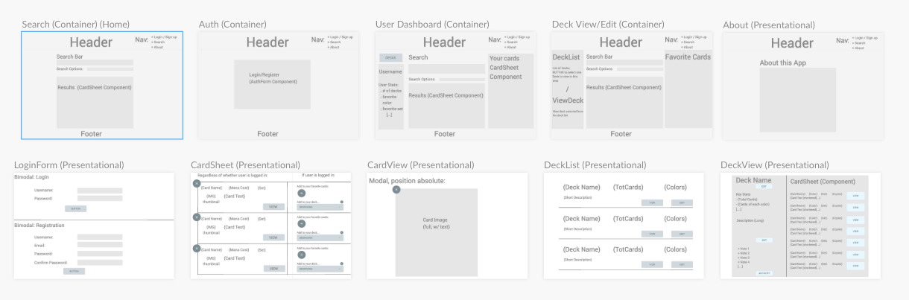

### "Smart" (Stateful) Container Components 

#### Search (Home):
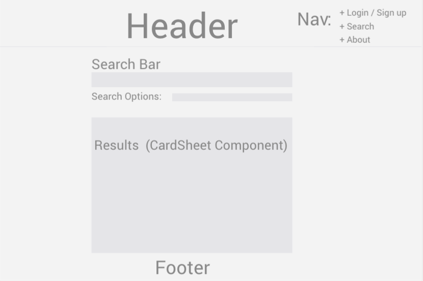

#### Authorization:
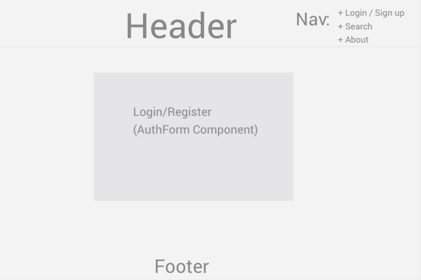

#### User Dashboard: 
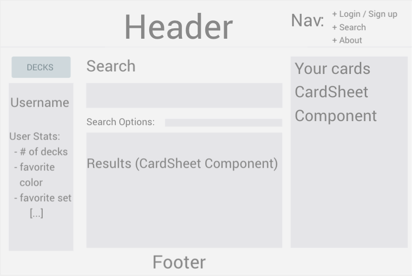

#### Deck View/Edit: 
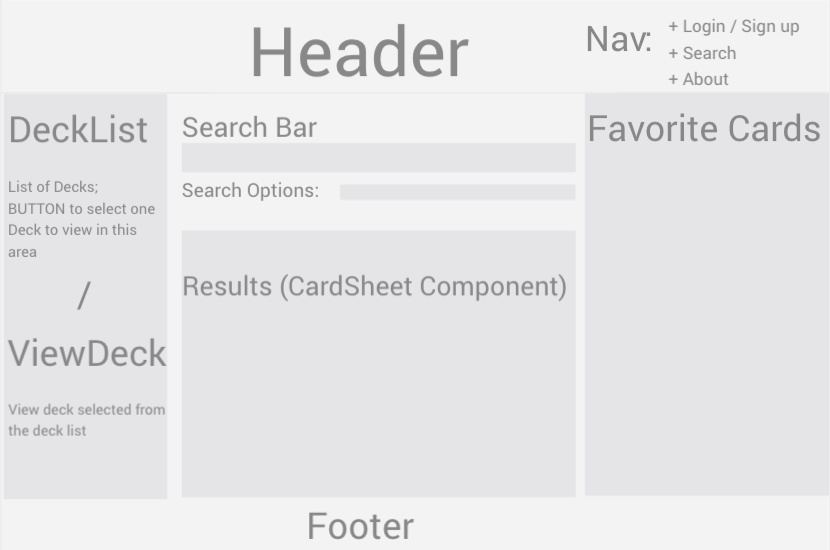

### "Dumb" (Stateless) Presentational Components 

#### About this App "Page":
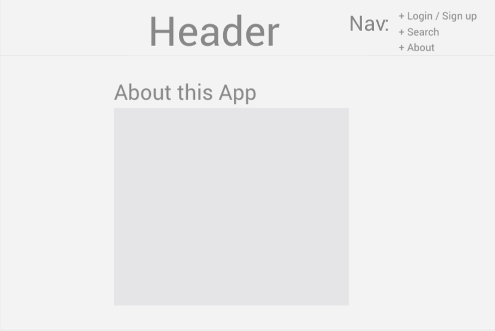

#### LoginForm (Modal LogIn/Register):
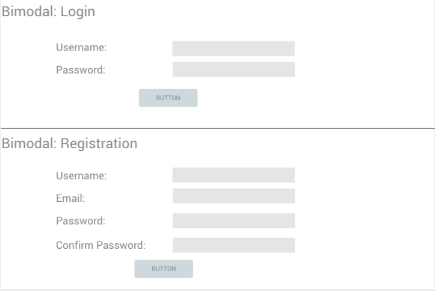

#### CardSheet: 
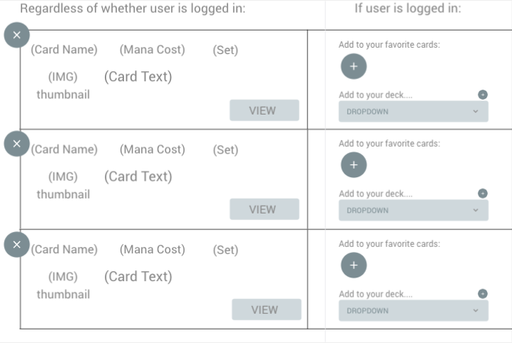

#### CardView (Modal On/Off): 
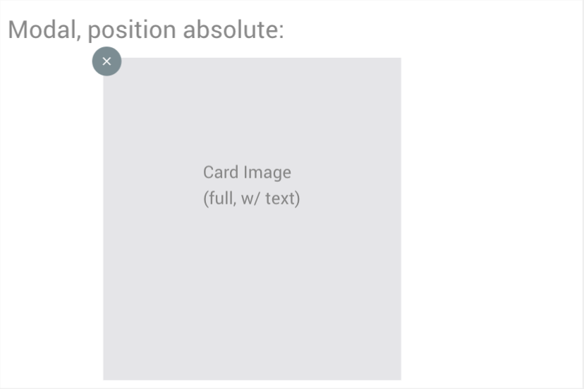

#### DeckList:
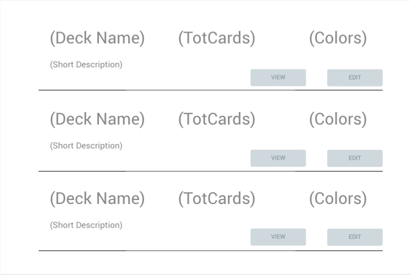

#### DeckView: 
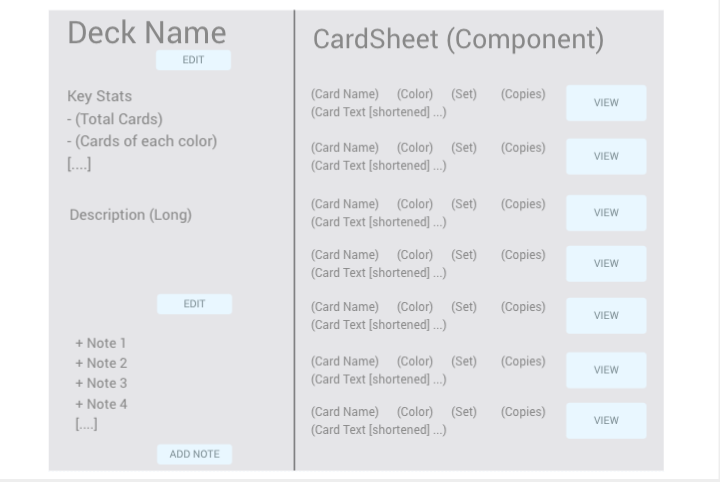

## Express Boilerplate 

### Available Scripts

In the project directory, you can run:

#### `npm start`

Runs the app in the development mode. 
Open [http://localhost:3000](http://localhost:3000) to view it in the browser.

The page will reload if you make edits. 
You will also see any lint errors in the console.

#### `npm test`

Launches the test runner in the interactive watch mode. 
See the section about [running tests](https://facebook.github.io/create-react-app/docs/running-tests) for more information.

#### `npm run build`

Builds the app for production to the `build` folder. 
It correctly bundles React in production mode and optimizes the build for the best performance.

The build is minified and the filenames include the hashes. 
Your app is ready to be deployed!

See the section about [deployment](https://facebook.github.io/create-react-app/docs/deployment) for more information.

#### `npm run eject`

**Note: this is a one-way operation. Once you `eject`, you can’t go back!**

If you aren’t satisfied with the build tool and configuration choices, you can `eject` at any time. This command will remove the single build dependency from your project.

Instead, it will copy all the configuration files and the transitive dependencies (Webpack, Babel, ESLint, etc) right into your project so you have full control over them. All of the commands except `eject` will still work, but they will point to the copied scripts so you can tweak them. At this point you’re on your own.

You don’t have to ever use `eject`. The curated feature set is suitable for small and middle deployments, and you shouldn’t feel obligated to use this feature. However we understand that this tool wouldn’t be useful if you couldn’t customize it when you are ready for it.

### Learn More

You can learn more in the [Create React App documentation](https://facebook.github.io/create-react-app/docs/getting-started).

To learn React, check out the [React documentation](https://reactjs.org/).

#### Code Splitting

This section has moved here: https://facebook.github.io/create-react-app/docs/code-splitting

#### Analyzing the Bundle Size

This section has moved here: https://facebook.github.io/create-react-app/docs/analyzing-the-bundle-size

#### Making a Progressive Web App

This section has moved here: https://facebook.github.io/create-react-app/docs/making-a-progressive-web-app

#### Advanced Configuration

This section has moved here: https://facebook.github.io/create-react-app/docs/advanced-configuration

#### Deployment

This section has moved here: https://facebook.github.io/create-react-app/docs/deployment

#### `npm run build` fails to minify

This section has moved here: https://facebook.github.io/create-react-app/docs/troubleshooting#npm-run-build-fails-to-minify
